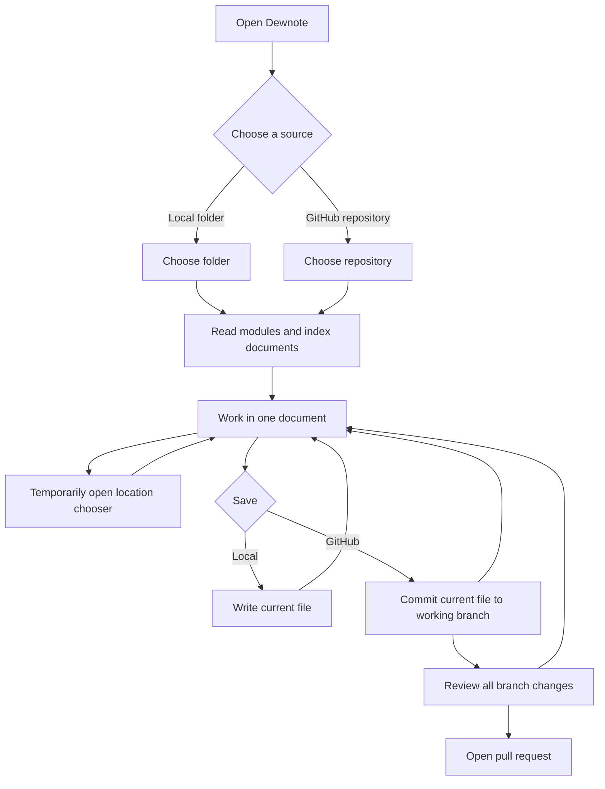

# Progressive workspace UI implementation plan

Written 2026-09-18 after reviewing Dewnote's local-folder and GitHub
workflows. This plan replaces the current collection of persistent rails and
drawers with a progressive interface: Dewnote asks for the decisions it needs
at the moment it needs them, then gets out of the document's way.

This is an implementation plan, not a visual specification. Existing design
tokens, typography, editor behaviour, document round-tripping, module parsing,
and store implementations remain authoritative.

---

## 1. Outcome

An author should experience Dewnote as six consecutive states:

1. choose where the work comes from;
2. choose the specific folder or repository;
3. locate a document through module, series, and tutorial structure;
4. work inside that document without permanent side panels;
5. save the document;
6. review repository-wide changes only when publishing.

The interface must express those states in time. It must not display all six
sets of controls simultaneously.



## 2. Design rules

### 2.1 Source choice is a gate, not navigation

The first screen presents two primary choices:

- **Open a local folder**
- **Connect a GitHub repository**

After the choice succeeds, it disappears. The selected source becomes passive
workspace identity in the document header. Changing source is available under
the workspace menu and starts a new session; Local and GitHub do not remain as
peer buttons beside the editor.

### 2.2 The document owns the workspace

While editing, no left or right panel is permanently open. The stable chrome is
one compact header containing:

- workspace identity and the workspace/file menu;
- the current module, series, and document location;
- save state and the primary Save action.

The rest of the window is the document. Block insertion and movement controls
remain contextual to the active or pointed-at block.

### 2.3 One temporary surface at a time

Navigation, save alternatives, transfer commands, and settings are transient
surfaces. Opening one closes any other. Every transient surface closes after a
successful choice, on Escape, and on an outside click.

Desktop may use anchored popovers. Narrow layouts may replace the document with
a sheet or full-page chooser. These are two responsive presentations of the
same state, not separate features.

### 2.4 Navigation represents authored structure

The location chooser has three dependent levels:

```text
Module → Series → Tutorial or practice page
```

It reads module descriptor order. A focused practice page appears with its
tutorial rather than as an unrelated repository file. Selecting through the
location chooser updates the header immediately and closes the chooser.

Raw files remain an advanced fallback inside the workspace menu. They are not
the default repository landing screen.

### 2.5 Saving and publishing are different decisions

The primary Save action means:

- local session: write the current document to its current path;
- GitHub session: commit the current document to the working branch.

The adjacent alternatives menu contains **Save as a new version…** where the
current document supports Dewlab versioning. It must explain which release will
be frozen and which canonical file will be updated before committing.

Publishing is repository-wide. It appears only after the working branch has
changes and opens a dedicated review state. It is not permanently mixed into
the document editor.

### 2.6 Document transfer is document-scoped

Import notebook, export notebook, and export HTML belong in the workspace/file
menu. They open only when requested and operate on the current document. They
are not permanent floating actions.

## 3. UI states

### State A — source choice

Visible:

- Dewnote identity;
- short explanation;
- local-folder choice;
- GitHub-repository choice.

Absent:

- document editor;
- module navigation;
- save, version, and pull-request controls;
- settings and transfer rails.

Acceptance:

- keyboard focus starts on the first source option;
- both options have visible labels and explanations;
- choosing GitHub proceeds to repository choice;
- choosing local invokes folder selection and proceeds only after a successful
  folder grant;
- cancellation returns to the same source-choice screen.

### State B — source detail

For GitHub, show repository selection and the base branch. For local, use the
platform folder picker rather than recreating one in Dewnote.

While indexing, show one honest progress message. If individual module or
document files cannot be read, complete the usable workspace and present a
concise warning with a route to the affected paths.

Acceptance:

- the editor is not shown before a source succeeds;
- an empty or unstructured repository offers raw-file browsing without
  pretending that modules were found;
- a repository with valid descriptors opens at its first authored module,
  series, and live tutorial;
- the chosen session kind becomes immutable until Change workspace is used.

### State C — document workspace

Header layout:

```text
[workspace menu] workspace identity   [module › series › document]   saved state [Save ▾]
```

Document layout:

- current filename appears quietly above the document title;
- front matter is represented by the existing document-details interaction;
- rendered prose, code cells, questions, hints, cards, and site panes retain
  their current editor behaviour;
- no repository, outline, transfer, or settings drawer is open by default.

Acceptance:

- opening a document leaves the full available width to the document;
- entering and leaving a prose editor does not move the text baseline;
- Python and SQL cells retain caret visibility, syntax highlighting, and run
  controls;
- the filename, workspace identity, and dirty state remain visible;
- Cmd/Ctrl+S invokes the session's primary Save action.

### State D — temporary location chooser

Opened by the location control in the header. It displays modules, then the
selected module's series, then the selected series' tutorial/practice entries.

Behaviour:

- changing module updates series and document choices without navigating yet;
- choosing a document performs navigation and closes the surface;
- the current item is visibly and programmatically selected;
- Escape and outside click close it without changing the document;
- only this one transient surface may be open;
- on narrow screens it becomes a page/sheet with an explicit Back action.

Acceptance:

- module and series order matches the descriptors;
- practice pages are grouped with their tutorial;
- a tutorial present in several versions resolves to the preferred live file;
- the chosen module context is retained while moving among its documents;
- a malformed descriptor produces a visible warning but does not erase other
  modules.

### State E — save decision

Clicking Save performs the primary save immediately. Clicking its adjacent
arrow opens alternatives:

- Save current file;
- Save as a new version… when supported.

After success, update the saved/dirty state and show a temporary confirmation.
For GitHub, that confirmation may offer **Review repository changes**. For a
local session it must not mention branches or pull requests.

Acceptance:

- opening and saving an unchanged file never creates a false dirty state;
- a GitHub save commits to the selected working branch using the correct blob
  SHA;
- a local save writes to the current handle;
- Save as a new version previews the old version, new version, frozen path, and
  live path before writing;
- conflict handling preserves both versions and does not silently overwrite;
- the save menu closes after the decision.

### State F — repository change review

This state replaces the editor after the author explicitly chooses Review
repository changes. It lists every branch change, including module descriptor
edits made through the organiser.

Visible:

- working branch and base branch;
- changed path, type of change, and plain-language summary;
- Keep editing;
- Open pull request.

Acceptance:

- a module-only edit can reach this state without an unrelated document push;
- Keep editing returns to the same document and cursor context where practical;
- Open pull request uses all working-branch changes;
- after the pull request is opened, the resulting link remains available from
  the workspace menu/status;
- local sessions can never enter this state.

## 4. State model

Introduce one application-level workspace state rather than inferring the
workflow from whichever panel happens to be open.

```ts
type SessionKind = "local" | "github";
type AppScreen = "choose-source" | "choose-repository" | "document" | "review-changes";
type TransientSurface = "location" | "save-options" | "workspace-menu" | null;

interface WorkspaceSession {
  kind: SessionKind;
  label: string;
  store: ActiveStore;
  modules: ModuleDescriptor[];
  index: FileIndexEntry[];
  currentPath: string | null;
}

interface AppState {
  screen: AppScreen;
  session: WorkspaceSession | null;
  surface: TransientSurface;
  savedSource: string;
  workingSource: string;
  branchChanges: RepositoryChange[];
}
```

Rules:

- `screen` controls the major workflow step;
- `surface` controls the one optional overlay within the document step;
- `session.kind` controls save and publish capability;
- dirty state is `workingSource !== savedSource`, reset only after a confirmed
  open or save;
- module selection, breadcrumb text, and current path derive from the same
  workspace state;
- panel visibility is not application state.

## 5. Component changes

### Replace the rail shell

Replace the current grouped icon rail and persistent dock as the main
application shell with:

- `source-choice.ts` — initial two-choice gate;
- `workspace-header.ts` — workspace identity, location and Save;
- `location-chooser.ts` — transient module/series/document navigation;
- `workspace-menu.ts` — transfer, settings, raw files and Change workspace;
- `change-review.ts` — repository-wide publishing step;
- `app-state.ts` — state transitions and capability derivation.

The old panels may continue to supply internal content during migration, but
they must not remain independent global launchers at the end.

### Reuse existing behaviour

Reuse rather than rewrite:

- `folder-panel.ts` and folder-store operations behind source choice;
- `repo-panel.ts` GitHub API, branch, conflict, version, and PR operations;
- `modules.ts`, `file-index.ts`, and `workspace-nav.ts` for structure;
- `file-bar.ts` dirty tracking and document import/export actions;
- `settings-panel.ts` settings controls;
- `source-view.ts`, `outline-panel.ts`, and `link-check.ts` as commands or
  contextual document surfaces;
- the current editor and block menus unchanged except where layout integration
  requires it.

The first pass should move ownership of these behaviours without rewriting
their lower-level operations.

### Retire after parity

Remove or reduce:

- the permanent right-side dock and resize affordance;
- peer-level Folder and GitHub launchers after a session starts;
- persistent Import/Export bubbles;
- repository files as the default GitHub view;
- separate UI state held independently by the location breadcrumbs, module
  organiser, file bar, and repository panel.

Keep whole-file source, outline, link checking, and settings reachable through
the workspace menu or command palette. Their exact transient presentation can
be migrated after the workflow shell is stable.

## 6. Implementation sequence

### Phase 1 — application state and source gate

1. Add `app-state.ts` with explicit screen, session, surface, and dirty state.
2. Render the source-choice screen before mounting workspace tools.
3. Adapt local and GitHub open flows to resolve a `WorkspaceSession`.
4. Add Change workspace with an unsaved-changes guard.
5. Leave existing panels callable internally while the new shell is built.

Done when both session types enter the same document workspace and no Local /
GitHub choice remains beside the editor.

### Phase 2 — document header

1. Replace the file bar and primary rail chrome with `workspace-header.ts`.
2. Connect filename, workspace label, current location, dirty state, and Save.
3. Move import/export and settings into a temporary workspace menu.
4. Preserve keyboard shortcuts and accessible labels.

Done when a document opens with no permanent side panel and all existing
document actions remain reachable.

### Phase 3 — structured location chooser

1. Extract the module/series/tutorial selection logic from the current
   workspace navigation and repository modules view.
2. Render it as one dependent, transient chooser.
3. Add the responsive full-page/sheet presentation.
4. Keep raw-file browsing as an advanced workspace-menu route.

Done when an author can traverse a real Dewlab repository without using its
raw file list, and choosing an entry closes the navigator.

### Phase 4 — unified saving

1. Give the active store one primary `saveCurrent` operation.
2. Connect Cmd/Ctrl+S and the header Save button to it.
3. Move version creation into the Save alternatives menu.
4. Replace repository-panel status text with application save state and a
   temporary confirmation.
5. Keep existing conflict resolution, but present it as a focused decision.

Done when local and GitHub saving share one visible interaction while retaining
their different persistence semantics.

### Phase 5 — change review and publishing

1. Track branch changes made by document saves, module writes, and asset writes.
2. Add the repository change-review screen.
3. Move pull-request creation into that screen.
4. Preserve the PR link in session state.
5. Remove the publishing section from the old repository panel.

Done when every GitHub change has a route to one review and one pull request,
and no publishing control appears in a local session.

### Phase 6 — remove obsolete shell code

1. Migrate outline, link checking, source, settings, and transfer entry points.
2. Remove the grouped rail, persistent dock layout, divider, and panel-width
   storage when no caller remains.
3. Remove duplicate session and selection state.
4. Update screenshots, README descriptions, decisions, and keyboard help.

Done when the obsolete UI cannot be reached and no compatibility CSS is left
behind solely for it.

## 7. Testing strategy

### State-transition tests

- initial render has exactly two source choices and no editor;
- cancelling either chooser returns safely;
- successful source selection reaches the document screen;
- Change workspace returns to source choice only after resolving dirty work;
- only one transient surface can be open;
- Escape and outside click close the active surface;
- review is reachable only from a GitHub session with branch changes.

### Local journey

1. choose local;
2. grant a fixture folder;
3. navigate module → series → tutorial;
4. edit prose and a Python cell;
5. save with Cmd/Ctrl+S;
6. verify the file and clean saved state;
7. verify no branch, version, or PR language appears unless the document itself
   supports local version creation.

### GitHub journey

1. choose GitHub;
2. select a mocked Dewlab repository;
3. verify descriptor order and practice grouping;
4. edit and save the current tutorial;
5. reorder a module;
6. review both changes together;
7. open a pull request;
8. verify conflicts and version creation remain explicit and lossless.

### Editor regression coverage

Retain the existing real-browser tests for:

- text position between render and edit states;
- visible caret and syntax highlighting;
- Python and SQL execution;
- every slash-menu block type;
- block insertion, deletion, and movement;
- byte-for-byte untouched-document round trips.

### Accessibility and responsive coverage

- every interactive element has a visible label or accessible name;
- source choices and transient surfaces are fully keyboard-operable;
- focus moves into an opened chooser and returns to its trigger when closed;
- coarse-pointer targets are approximately 44 by 44 pixels;
- at narrow width, navigation and review replace rather than squeeze the
  document;
- light and dark themes retain sufficient contrast;
- reduced-motion users receive no required animated transition.

## 8. Migration risks

**State split across current components.** The repository panel, file bar,
workspace navigation, and dock each own part of the current workflow. Moving
visuals before centralising state would preserve the same bugs under new
chrome. Phase 1 must land first.

**Loss of advanced actions.** Removing rails can make features disappear if
the workspace menu and command palette do not reach parity first. Maintain a
temporary feature-route checklist during phases 2–6.

**Repository and module changes diverge.** A document push and a module reorder
currently travel through related but different paths. The review screen must
consume branch-level changes, not only changes initiated by the active editor.

**Transient surfaces become hidden permanent panels.** A large popover that
never closes recreates the original problem. Tests must assert closure after a
selection, Escape, and outside click.

**Responsive behaviour becomes a compressed desktop shell.** Narrow layouts
must promote choosers to sheets/pages rather than reducing three columns until
none is readable.

## 9. Non-goals

- changing the markdown document model;
- changing module descriptor syntax or repository layout;
- replacing CodeMirror or the Python/SQL runtimes;
- redesigning individual block types;
- adding collaboration, authentication roles, or background synchronisation;
- making repository files the primary information architecture;
- keeping the current dock merely restyled.

## 10. Completion criteria

The workflow redesign is complete when:

- Dewnote begins with one explicit Local/GitHub decision;
- that decision disappears after the session starts;
- the document screen has no permanently open side panel;
- module → series → tutorial navigation appears only when requested;
- one primary Save action works according to session kind;
- version creation is a deliberate save alternative;
- repository-wide changes are reviewed in a separate publishing step;
- import/export and settings remain reachable without permanent bubbles;
- local and GitHub end-to-end journeys pass in real browsers;
- the existing document round-trip and editor interaction suites remain green.
